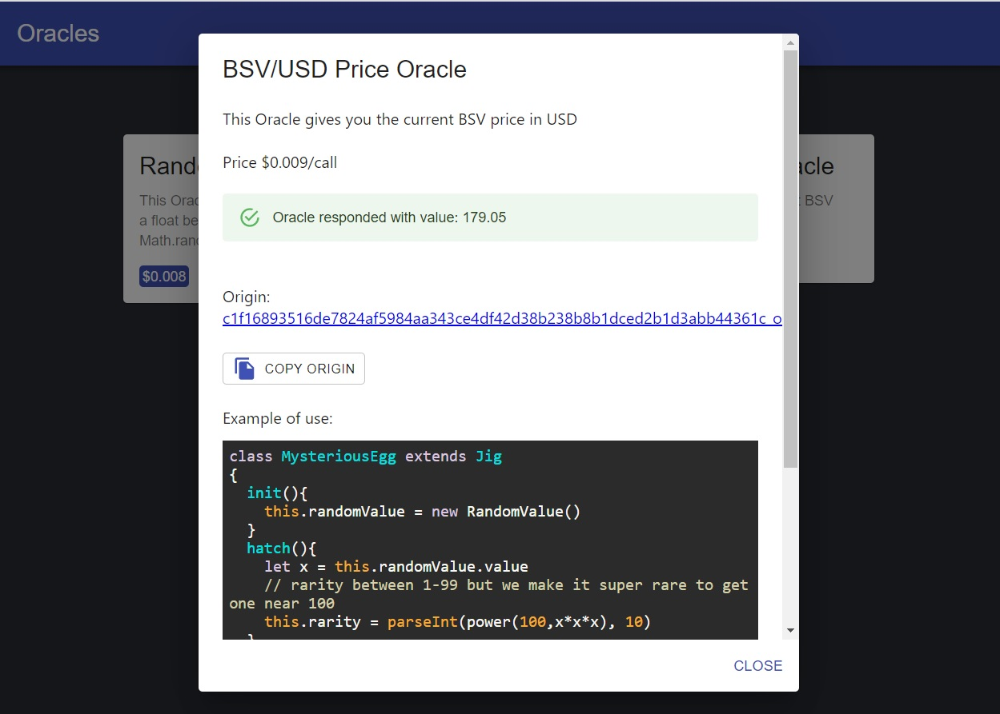

# Functional USD priced RUN Oracles [RUN2k21 Hackaton]

> **Allowing anyone to inject random values, the current time, or the BSVUSD price in any RUN Jig - and make jigs react differently based on them!**

___________________



# What's the deal

This repo is mostly a React front-end that displays how a website can use jigs to get values from the functional RUN oracles we deployed. We also provide a nodejs example. This repo is deployed on github-pages at **[zhell1.github.io/RUN2k21](https://zhell1.github.io/RUN2k21/)**  and at  **[run2k21.runcraft.io](http://run2k21.runcraft.io/ )**

You can find a conceptual example of using those oracles for a Super Rare Egg NFT that can only be hatched on full moons in `/src/MysteriousEgg.js`

A nodejs functional exemple of creating an oracleRequest, funding it, and getting the value set by the oracle can be found in `/src/test.js` 

The backend for those oracles was also created for the RUN2K21 Hackaton and is running on a private server.

____________

# Testing

Just go to **[zhell1.github.io/RUN2k21](https://zhell1.github.io/RUN2k21/)**  or  **[run2k21.runcraft.io](http://run2k21.runcraft.io/ )**

Click on any oracle, then click the `TEST ORACLE` button, and fund the transaction with any BSV wallet.
The oracle should answer you directly in your jigs !


____________

# Our Adventure

### Motivation

Oracles are based on trust, so they need to be able to establish trust over a long period of time

### Problem

Establishing trust can hardly be done with satoshi-priced oracles as crypto prices are very volatile. The BSV/USD price proved it well in past few months. Basically the issue is:
- **if price does x10, your oracle price does too. It is now too expensive to use.**
- **if price does /10, your oracle might be losing money now.**

### Idea

We need a solution for usd-priced oracles on RUN.

### Hardships

We don't have a bsv/usd price onchain as a run contract. Even if we did the contract would get updated a lot, quickly becoming extremely slow to sync, at least until all apps have trusted cache servers. But we are still far from it today.

### Goals

We want an oracle that has those properties:

- is priced in usd
- can reliably be called despite price volatility
- can update its usd price both downward & upward
- has 0 sync issues for users even if updating its price, even upward
- can be profitable - it must not waste money uselessly

### Epic fails

- we experimented with 3-steps oracle: init to get the bsvusd price, then fund the actual oracle request, then get the value. This was too complicated for users and doesn't really solves the root problem.
- our first proof of concept required to update all oracles' prices at least once every day. This would have made it hard for the oracles to stay profitable. It would also have made them very slow to load over time, at least without a trusted cache server.

## Solution

Our BSVUSD oracle doesn't have an onchain satoshi price, but it has an onchain USD price.

The user must retrieve the usd price by any way of his choice, then use it to compute the number of satoshis to pay. Then he puts it in the init() call creating the oracleRequest.

**This solution can seem simple, but after experiencing with many alternatives we can say it has beauty in its simplicity. And with a few safety measures to deal with onchain syncing issues, we have been able to make it work flawlessly.**

##### Safety measure 1: Price margin tolerance
To allow for discrepencies in price retrieval, we allow for a 20% margin below our own computed price. You might try to use this to get a discount, but to make sure everything flows perfectly every time, we recommend users send their exact computed price. Sending lower amounts could result in un-answered oracleRequests.
In the future we may provide an API to get the exact price in satoshis but we rather have as much as possible working directly on the blockchain.

##### Safety measure 2: Users control their own price limit
The other oracles work the same way, which has the benefit that it allows the user to check the price of the oracle in usd. So even if the oracle's administrator updates the price, the user can check in his code a maximum limit price to pay in USD. If the oracle service increases its price too much, the user is safe that he will not go beyond his own limit. Combining this with a few oracles for the same value offers a very good compromise.

##### Safety measure 2: Time window tolerance
When the oracle price is updated, if you create an oracleRequest at the same time, there is usually a syncing risk. This would usually result in an un-answered request. To remove that risk, we introduce a window of time after any price update, where the oracle will tolerate the user paying the previous price. Both prices are always saved in the oracle contract for provability. The time window is not disclosed to limit abuses and may change at any time, as we only care about honest users.

**So always make sure to sync() the oracle to use the latest price and it will work flawlessly - combined with our tolerance window!**

_________________

# Basic Example

```js
var RandomValueRequest = await load_contract(RandomValueLocation)
// sync for safety
await RandomValueRequest.sync()

// sync oracle for latest .priceUSD
let my_oracle = RandomValueRequest.oracle
await my_oracle.sync()

let bsvusd = await get_bsvusd()
let topay_satoshis = parseInt(my_oracle.priceUSD / bsvusd * 1e8, 10)

let myRandomValue = new RandomValueRequest(topay_satoshis)
await run.sync()
setTimeout(async ()=>{
    await myRandomValue.sync()
    console.log("oracle answered : ",myRandomValue.value)
}, 8000)
```

_________________

# Architecture

## Oracle

Each Oracle is itself an NFT that can be transferred to another administrator.
The usd price can be changed, it allows you to update a message for users, and to deprecate the oracle.

## OracleRequest

This class must be extended.
This the parent class of the instances that the users actually create.
They all have an Oracle linked to them that gives the latest usd price for calls of this oracle.
To use this usd-priced OracleRequest you will:

```text
1) Compute the amount of satoshis to pay on your side:
    - get the current bsv/usd price from an API
    - get the usd price from oracleRequest.oracle.priceUSD
    - pass that amount of satoshis in init() like: new RandomValue(parseInt(priceUSD / bsvusd * 1e8, 10))
    
2) You then wait for the oracle to set() the oracleRequest.value
    for a faster answer,  use a retry loop that periodically syncs your jig & reads the value
```

## Extends from OracleRequest

They are used to create the different OracleRequests classes that users instantiate. For example:

```js
export class RandomValueRequest extends OracleRequest_priceUSD {}
RandomValueRequest.description="get a random value as a float between 0 and 1, same as Math.random() but for jigs."
```

_________________

## Other ideas that might improve this project

- **accept relayx-USDC tokens as payment aside from satoshis, that would make everything easier for price calculation**
- provide an npm package as an easy way to use the oracles with their satoshi prices
- provide an API to get the satoshi price of oracles
- accept the price paid based on either the current or the last 24h average to reduce price volatility risk for users even more
- provide an API with a /{txid} endpoint to get the status of our tx when it failed to get set() by oracle
        ex "too low payment amount"
- find a way to let users submit a recent onchain Preev tx in init() as a proof of bsvusd price they want to use
- let users submit in init() a previous onchain tx of a BSVUSDrequest, the oracle will check that it is recent enough to be considered valid

_________________

# Building

Based on your build target you might need to specify the "homepage" property in package.json:

For example on local & on runcraft.io, you should use no homepage.
For github pages you should add something like:
`"homepage": "https://zhell1.github.io/RUN2k21/"`

Then run

```bash
    npm run build
    serve -s build
```
